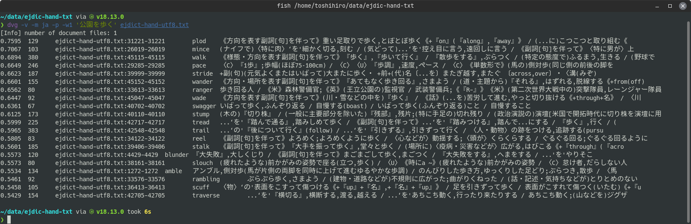

[](https://github.com/tos-kamiya/dvg/actions/workflows/tests.yaml) [](https://github.com/tos-kamiya/dvg/actions/workflows/codeql-analysis.yml)

# dvg

`dvg`は、意味的類似検索を行うgrepです。
SCDVモデルを使って、クエリのフレーズに似た部分を含む文書ファイルを検索します。
テキストファイル（.txt）、PDFファイル（.pdf）、MS Wordファイル（.docx）からの検索に対応しています。


## インストール

&rarr; [Ubuntuでのインストール](docs/installation-on-ubuntu.ja_JP.md)  
&rarr; [Windowsでのインストール](docs/installation-on-windows.ja_JP.md)  

## TL;DR（典型的な利用法）

文書ファイルからクエリとなるフレーズに近いものを探す。

```sh
dvg -v -m ja <クエリとなるフレーズ> <文書ファイル>...
```

検索の実行例:  


出力の各行は、左から順に、類似度（数字が1に近いほど類似度が高い）、パラグラフの長さ（文字数）、ファイル名、行番号の範囲となっています。

## コマンドラインオプション

`dvg`にはいくつかオプションがあります。よく使われるであろうものを説明します。

`--verbose, -v`  
Verboseオプションです。指定すると、検索の進行中に、その時点で最も類似度の高いドキュメントを表示します。

`--model=MODEL, -m MODEL`  
使用可能なモデルは、`en` (英語の文書向け)、`ja` (日本語の文書向け)です。

`--top-n=NUM, -t NUM`  
上位のNUMドキュメントを結果として表示します。既定値は20です。
0を指定すると、検索されたすべての文書を、クエリとの一致度でソートして表示します。

`--paragraph, -p`  
このオプションを指定すると、1つの文書ファイル内のそれぞれのパラグラフがドキュメントとみなされます。検索結果に1つの文書ファイルの複数のパラグラフが出力されるようになります。
このオプションが指定されていない場合、1つの文書ファイルが1つのドキュメントとみなされます。検索結果に1つの文書ファイルはたかだか1回だけ表示されます。

`--window=NUM, -w NUM`  
この数字で指定された行のかたまりを1つのパラグラフとして認識します。
既定値は20です。

`--include=TEXT, -i TEXT`  
指定された文字列が含まれていないパラグラフを検索結果から取り除きます。

`--exclude=TEXT, -e TEXT`  
指定された文字列が含まれているパラグラフを検索結果から取り除きます。

`--prefer-longer-than=CHARS, -l CHARS`  
パラグラフの長さ（文字数）がこれより小さいときは、類似度の値を小さくします。

`--worker=NUM, -j NUM`  
ワーカープロセスの数。並列実行のためのオプションです。

## テキストファイルの各行を検索する

オプション`--paragraph`と`--window=1`を同時に指定すると、テキストファイルの各行を対象とした検索を行うことができます。

辞書データ[ejdict-hand](https://github.com/kujirahand/EJDict)から検索した例:  


## トラブルシューティング

| 状況 | 対策 |
| --- | --- |
| dvgの**インストールに失敗**する。「pdftotext」がインストールできないというエラーメッセージが出力される。 |  pdftotextは、pipコマンドだけではインストールできません。インストールの手順を参照してください。 |
| dvgを実行しようとすると **「ModuleNotFoundError: No module named 'fugashi'」** といったエラーメッセージが出る。 | pipコマンドで`dvg[ja]`のように`[ja]`をつけて再インストールしてください。 |
| dvgを実行中に **「UnicodeEncodeError: 'cp932' codec can't encode character ...」** とっいたエラーメッセージが出る。 | ファイルの文字コードに関するエラーです。Windows上で実行している場合は「NKFのインストール」を行ってみてください。 |

## 謝辞

膨大な言語コーパスを提供されているWikipediaに感謝いたします:  
https://dumps.wikimedia.org/

SCDV(Sparse Composite Document Vectors)についてはD. Mekalaらのこちらの論文を参照してください:  
https://arxiv.org/abs/1612.06778

## ライセンス

dvgは [BSD-2](https://opensource.org/licenses/BSD-2-Clause) ライセンスで配布されます。
