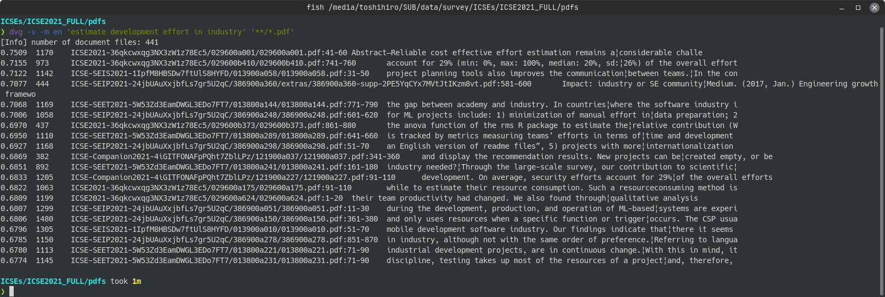

[](https://github.com/tos-kamiya/dvg/actions/workflows/tests.yaml) [](https://github.com/tos-kamiya/dvg/actions/workflows/codeql-analysis.yml)

&rarr; doc [main](https://github.com/tos-kamiya/dvg/) | [dev](https://github.com/tos-kamiya/dvg/tree/dev)  
&rarr; Japanese doc [main](https://github.com/tos-kamiya/dvg/blob/main/README.ja_JP.md) | [dev](https://github.com/tos-kamiya/dvg/blob/dev/README.ja_JP.md)  

⚠️ Warning: `dvg` is **incomplatible with CPython 3.11**, because some of its dependencyies are so.  

⚠️ Warning: In version 1.0.0b9, the model files have been revamped and now have a larger vocabulary and (vector) dimension. Due to PyPI space limitations, model files are not included in the distribution package; they are **downloaded from a website (https://toshihirokamiya.com/) at the first time you run `dvg`**.  

# dvg

`dvg` is an off-the-shelf grep tool that performs semantic similarity search, for Windows, macOS, and Ubuntu.

With SCDV models, search document files that contain similar parts to query.
Supports searching within text files (.txt), PDF files (.pdf), and MS Word files (.docx).

## Installation

Basically, it can be installed with `pip dvg`, but if you want to target PDF files or Japanese documents in addition to English, you need to install an option.

&rarr; [Installation on Ubuntu / macOS](docs/installation-on-ubuntu.md)  
&rarr; [Installation on Windows](docs/installation-on-windows.md)  

## TL;DR (typical usage)

Search for the document files similar to the query phrase.

```sh
dvg -v -m en <query_phrase> <document_files>...
```

Example of search:  


Each line of output is, from left to right, similarity (the closer the number is to 1, the higher the similarity), length (characters) of the paragraph, file name, and range of line numbers.

## Command-line options

`dvg` has several options. Here are some options that may be used frequently.

`--verbose, -v`  
Verbose option. If specified, it will show the documents that have the highest similarity at that time.

`--model=MODEL, -m MODEL`  
The available models are `en` (for English documents) and `ja` (for Japanese documents).

`--top-n=NUM, -n NUM`  
Show top NUM documents as results. The default value is 20.
Specify `0` to show all the documents searched, sorted by the degree of match to the query.

`--paragraph, -p`  
If this option is specified, each paragraph in one document file will be considered as a document. Multiple paragraphs of a single document file will be output in the search results.
If this option is not specified, one document file will be considered as one document. A single document file will be displayed in the search results only once at most.

`--window=NUM, -w NUM`  
A chunk of lines specified by this number will be recognized as a paragraph.
The default value is 20.

`--query-file=QUERYFILE, -f QUERYFILE`  
Read query text from the file.
The query file could be a PDF as well as a text file, like document files.

(As far as I have tried, when the query is specified as a file, better results tend to be obtained by increasing the size of the paragraph with the --window option, e.g. `-w 80`)

`--include=TEXT, -i TEXT`  
Only paragraphs that contain the specified string will be included in the search results.

`--exclude=TEXT, -e TEXT`  
Only paragraphs that do not contain the specified string will be included in the search results.

`--min-length=CHARS, -l CHARS`  
Paragraphs shorter than this value get their similarity values lowered. You can use this to exclude short paragraphs from the search results. The default value is 80.

`--excerpt-length=CHARS, -t CHARS`  
The length of the excerpt displayed in the rightmost column of the search results. The default value is 80.

`--header, -H`  
Add a heading line to the output.

`--worker=NUM, -j NUM`  
Number of worker processes. Option to run in parallel.

## Search individual lines of a text file

If you specify the options `--paragraph` and `--window=1` at the same time, you can search for individual lines in a text file. 

Example of searching from dictionary data [Webster's Unabridged English Dictionary](https://www.gutenberg.org/ebooks/29765):  


(The text file for the dictionary data was generated by processing the json file available at https://github.com/adambom/dictionary.)

## Indexing

&rarr; [Indexing](docs/indexing.md)  

## Troubleshooting

&rarr; [When I try to run dvg, I get an error message like: "ModuleNotFoundError: No module named 'docopt'".](docs/troubleshooting.md#no-docopt)

&rarr; [When I try to run dvg, I get an error message like "dvg: command not found ".](docs/troubleshooting.md#command-not-found)

&rarr; [While running dvg, a warning message "None of PyTorch, TensorFlow >= 2.0, or Flax have been found..." appears.](docs/troubleshooting.md#none-of-pytorch)

## Todo

- [x] Replace the examples figure in the README with ones with the new model.
- [x] Replace wildcard expansion in Windows with one using `win_wildcard`.

## Acknowledgements

Thanks to Wikipedia for releasing a huge corpus of languages:  
https://dumps.wikimedia.org/

## License

dvg is distributed under [BSD-2](https://opensource.org/licenses/BSD-2-Clause) license.

## Links

* PyPI page https://pypi.org/project/dvg/

* D. Mekala et al., "SCDV: Sparse Composite Document Vectors using soft clustering over distributional representations," https://arxiv.org/abs/1612.06778

