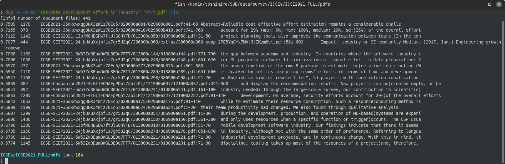

[](https://github.com/tos-kamiya/dvg/actions/workflows/tests.yaml) [](https://github.com/tos-kamiya/dvg/actions/workflows/codeql-analysis.yml)

&rarr; doc [main](https://github.com/tos-kamiya/dvg/) | [dev](https://github.com/tos-kamiya/dvg/tree/dev)  
&rarr; Japanese doc [main](https://github.com/tos-kamiya/dvg/blob/main/README.ja_JP.md) | [dev](https://github.com/tos-kamiya/dvg/blob/dev/README.ja_JP.md)  

# dvg

`dvg` is a grep that performs semantic similarity search.
With SCDV models, search document files that contain similar parts to query.
Supports searching within text files (.txt), PDF files (.pdf), and MS Word files (.docx).

## Installation

&rarr; [Installation on Ubuntu](docs/installation-on-ubuntu.md)  
&rarr; [Installation on Windows](docs/installation-on-windows.md)  

## TL;DR (typical usage)

Search for the document files similar to the query phrase.

```sh
dvg -v -m en <query_phrase> <document_files>...
```

Example of search:  


Each line of output is, from left to right, similarity (the closer the number is to 1, the higher the similarity), length (characters) of the paragraph, file name, and range of line numbers.

## Command-line options

`dvg` has several options. Here are some options that may be used frequently.

`--verbose, -v`  
Verbose option. If specified, it will show the documents that have the highest similarity at that time.

`--model=MODEL, -m MODEL`.  
The available models are `en` (for English documents) and `ja` (for Japanese documents).

`--top-n=NUM, -n NUM`  
Show top NUM documents as results. The default value is 20.
Specify `0` to show all the documents searched, sorted by the degree of match to the query.

`--paragraph, -p`  
If this option is specified, each paragraph in one document file will be considered as a document. Multiple paragraphs of a single document file will be output in the search results.
If this option is not specified, one document file will be considered as one document. A single document file will be displayed in the search results only once at most.

`--window=NUM, -w NUM`  
A chunk of lines specified by this number will be recognized as a paragraph.
The default value is 20.

`--include=TEXT, -i TEXT`  
Only paragraphs that contain the specified string will be included in the search results.

`--exclude=TEXT, -e TEXT`  
Only paragraphs that do not contain the specified string will be included in the search results.

`--min-length=CHARS, -l CHARS`  
Paragraphs shorter than this value get their similarity values lowered. You can use this to exclude short paragraphs from the search results. The default value is 80.

`--excerpt-length=CHARS, -t CHARS`  
The length of the excerpt displayed in the rightmost column of the search results. The default value is 80.

`--header, -H`  
Add a heading line to the output.


`--worker=NUM, -j NUM`  
Number of worker processes. Option to run in parallel.

## Search individual lines of a text file

If you specify the options `--paragraph` and `--window=1` at the same time, you can search for individual lines in a text file. 

Example of searching from dictionary data [Webster's Unabridged English Dictionary](https://www.gutenberg.org/ebooks/29765):  


(The text file for the dictionary data was generated by processing the json file available at https://github.com/adambom/dictionary.)

## Indexing (experimental)

**This feature is experimental and the search results may be worse than the normal search (especially for document files with small similarity values).**

If you are repeatedly searching for the same document file, consider indexing the document files.

After creating an index DB, the performance of the search is boosted by pruning (filtering) the document files that are obviously not relevant to the query.
(The performance improvement comes from two things: fewer floating-point calculations to compute similarity, and fewer file IOs to read the document files).

(1) To perform indexing, make the directory where the document files are located the current directory and execute the command `dvgi --build` in that directory.

```sh
dvgi --build -m en <document_files>...
```

Note that the name of the command has been replaced by `dvgi`. Also, the document files you specify in indexing should be all the document files that may be the target of subsequent searches.

This command will create a subdirectory `.dvg` in the current directory, where the index DB will be placed.

(2) To perform a search using the indexing DB, execute the command line with the command `dvg` replaced by `dvgi` in the same current directory as when indexing was performed.

```sh
dvgi -v -m en <query_phrase> <document_files>...
```

Example of search using index DB:  


## Acknowledgements

Thanks to Wikipedia for releasing a huge corpus of languages:  
https://dumps.wikimedia.org/

For more information on SCDV(Sparse Composite Document Vectors), refer the paper by D. Mekala et al.:  
https://arxiv.org/abs/1612.06778

## License

dvg is distributed under [BSD-2](https://opensource.org/licenses/BSD-2-Clause) license.

