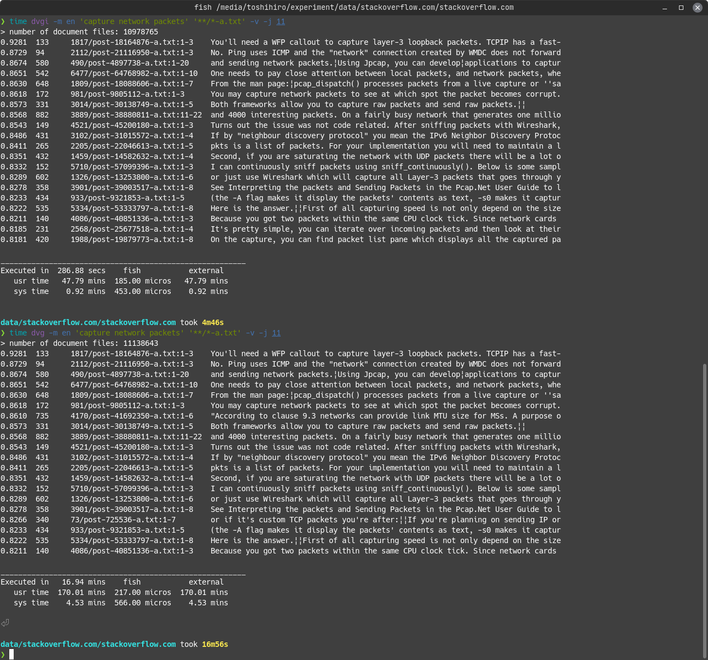

## Indexing (Experimental)

If you are repeatedly searching for the same document file, consider indexing the document files.

The `dvg` index entity is a small data set that approximates a vector representing the meaning of the documents to be searched. The indexing improves the speed of searches by aggressively eliminating the not-so-likely candidate documents.

However, **some of documents are excluded from the search results due to approximation accuracy issues**. Please be aware of this when using the indexing.

#### How to use the indexing

(1) To perform the indexing, make the directory where the document files are located the current directory and execute the command `dvgi --build` in that directory.

```sh
dvgi --build -m en <document_files>...
```

Note that the name of the command has been replaced by `dvgi`. Also, the document files you specify in the indexing should be all the document files that may be the target of subsequent searches.

This command will create a subdirectory `.dvg` in the current directory, where the index DB will be placed.

(2) To perform a search using the index DB, execute the command line with the command `dvg` replaced by `dvgi` in the same current directory as when the indexing was performed.

```sh
dvgi -v -m en <query_phrase> <document_files>...
```

Example of building an index DB:  


Example of and search with an index DB (and comparison with the regular search):  

